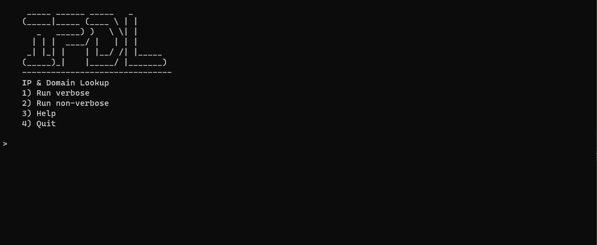

<!-- PROJECT SHIELDS -->
[![Contributors][contributors-shield]][contributors-url]
[![Forks][forks-shield]][forks-url]
[![Stargazers][stars-shield]][stars-url]
[![License][license-shield]][license-url]


<!-- PROJECT LOGO -->
<br />
<h3 align="center">IPDL</h3>
<p align="center">
  <br />
  IPDL: IP & Domain Lookup<br>
  IPDL offers a quick way to scan IP addresses and domains to detect potetially malicious actors
</p>


<!-- TABLE OF CONTENTS -->
<details open="open">
  <summary><h2 style="display: inline-block">Table of Contents</h2></summary>
  <ol>
    <li>
      <a href="#about-the-project">About The Project</a>
      <ul>
        <li><a href="#languages-and-frameworks">Languages and Frameworks</a></li>
      </ul>
    </li>
    <li>
      <a href="#getting-started">Getting Started</a>
      <ul>
        <li><a href="#prerequisites">Prerequisites</a></li>
        <li><a href="#installation">Installation</a></li>
      </ul>
    </li>
    <li><a href="#usage">Usage</a></li>
    <li><a href="#roadmap">Roadmap</a></li>
    <li><a href="#contributing">Contributing</a></li>
    <li><a href="#license">License</a></li>
    <li><a href="#contact">Contact</a></li>
    <li><a href="#acknowledgements">Acknowledgements</a></li>
  </ol>
</details>


<!-- ABOUT THE PROJECT -->
## About The Project




### Languages and Frameworks

* [Python3.9](https://www.python.org/)*

*Python3.6 or above is required due to the use of f-strings


<!-- GETTING STARTED -->
## Getting Started

### Prerequisites

This is an example of how to list things you need to use the software and how to install them.
* Install packages
  ```
  pip install pydnsbl
  pip install beautifulsoup4
  pip install requests
  pip install colorama
  pip install termcolor
  ```

### Installation

1. Clone the repo
   ```
   git clone https://github.com/albusnoir/ipdl.git
   ```


<!-- USAGE EXAMPLES -->
## Usage

IPDL has two modes: verbose and fast(non-verbose). Verbose will provide you with more information than fast will._

Pull_providers is an added feature that will pull providers down from https://multirbl.valli.org/list/ and add them to providers.txt to pull into the overarching provider list 

<!-- ROADMAP -->
## Roadmap
_Current_
- [x] Make the thing
- [x] ~~Brightcloud and VirusTotal sometimes differ in detection, is this an issue?~~ - Not an issue. Due to how "malicious" is defined and also how different providers use different blacklists, this is actually expected.
- [x] ~~Current limitations: adding / to a url breaks the code so it can't scan beyond site.com.~~ - You don't need to scan beyond root site.
- [x] Extend provider functionality

_Future Plans_
- [ ] should there be color (green v red) if detected/not? 


<!-- CONTRIBUTING -->
## Contributing

If you want to make contributions:

1. Fork this Repository
2. Create your Branch(`git checkout -b <branch name>`)
3. Commit your Changes(`git commit -m 'I did some things'`)
4. Push to the Branch(`git push origin <project_name>/<location>`)
5. Open a Pull Request


<!-- LICENSE -->
## License

Distributed under the GPLv3 License. See [`LICENSE INFO`](https://choosealicense.com/) for more information.


<!-- CONTACT -->
## Contact

Name | Social | Email |
------------ | ------------- | ------------- |
Name | [![Twitter][twitter-shield]][twitter-url] | <a href="mailto:kalegithub@gmail.com"></a>


<!-- ACKNOWLEDGEMENTS -->
## Acknowledgements & Contributions

#### Thank you to the following:

User | Contribution |
------------ | ------------- |


<!-- MARKDOWN LINKS & IMAGES -->
<!-- https://www.markdownguide.org/basic-syntax/#reference-style-links -->
[contributors-shield]: https://img.shields.io/github/contributors/albusnoir/IPDL.svg?style=for-the-badge
[contributors-url]: https://github.com/albusnoir/IPDL/graphs/contributors
[forks-shield]: https://img.shields.io/github/forks/albusnoir/IPDL.svg?style=for-the-badge
[forks-url]: https://github.com/albusnoir/IPDL/network/members
[stars-shield]: https://img.shields.io/github/stars/albusnoir/IPDL.svg?style=for-the-badge
[stars-url]: https://github.com/albusnoir/IPDL/stargazers
[license-shield]: https://img.shields.io/github/license/albusnoir/IPDL.svg?style=for-the-badge
[license-url]: https://github.com/albusnoir/IPDL/blob/master/LICENSE
[twitter-shield]: https://img.shields.io/badge/-twitter-Twitter?style=for-the-badge&logo=twitter&colorB=555
[twitter-url]: https://twitter.com/kaleleafygreen
